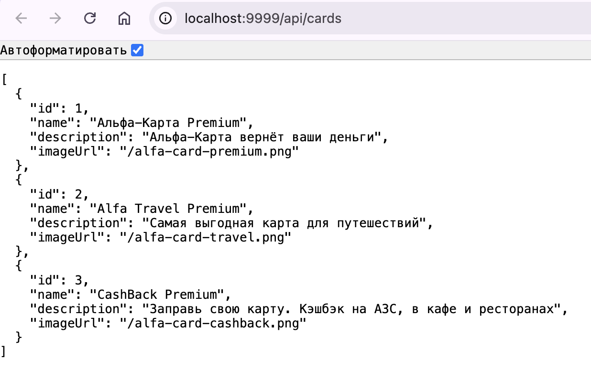

# Домашнее задание: PostgreSQL с Docker

## Результат выполнения задачи

Приложение успешно запущено и возвращает данные через API.

### Запуск:
```bash
# Запуск базы данных
docker-compose up -d

# Запуск приложения
java -jar db-api.jar
```

Проверка:
Открыть в браузере: http://localhost:9999/api/cards

Скриншот работы приложения:
